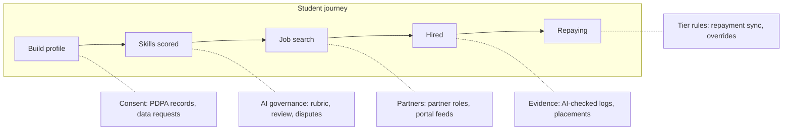

# Admin (Agency) Dashboard — Experience Flow

## Purpose, roles and principles

PTPTN's agency workspace: officers verify job search evidence, manage Talent Partners and portal feeds, govern the AI that scores students, manage courses and tier rules, and report outcomes to leadership. Every student-facing promise in the Student Dashboard has an admin control here.

| Role | Main job | Can | Cannot |
| --- | --- | --- | --- |
| Super admin | Platform configuration and access | Manage roles, settings, integrations | Edit individual skill scores |
| Programme officer | Day-to-day operations | Evidence queue, student cases, placements, partner role approvals | Change tier rules or taxonomy |
| Partnership manager | Talent Partners and portal agreements | Onboard, pause, end partners; manage portal feeds; partner reports | See repayment data |
| AI governance lead | Taxonomy, scoring rubric, evidence checks | Edit taxonomy, review AI samples, tune evidence rules | Approve partners |
| Learning manager | Course catalogue | Add, edit, retire courses and providers | See repayment data |
| Collection liaison | Link to repayment operations | Tier rules, job-seeking threshold, overrides, sync monitoring | Edit skills or partners |
| Leadership viewer | Oversight | Read-only reports | Any edits |

**Principles**

- **Queues first.** Home is work queues with counts and due times, not a wall of charts.
- **Every AI decision is reviewable.** Any score or evidence verdict opens to its evidence, rubric and model version.
- **Least data needed.** Repayment data stays with collection liaison and super admin.
- **Every action is logged.** Who, when, why.
- **Exceptions, not every case.** AI clears the routine; officers handle the flagged minority.

## At a glance: admin controls behind the student journey

Across every step: reports, audit log, role-based access.

## Admin home: command centre

Answers: what needs my action today, and is the programme on track. Adapts to role.

1. **Header.** Role badge, global search (student, partner, case ID), notifications, BM/EN toggle.
2. **My queues.** One card per queue: count, oldest item age, SLA status (on time, due today, overdue).
3. **Programme pulse.** 5 headline numbers with change vs last month: students visible, active Talent Partners, verified job search entries, placements this month, Tier A share.
4. **Alerts.** Repayment sync failed, portal feed stale, evidence escalation spike, AI confidence dropping.
5. **Recent activity.** Last 10 actions by this officer, with undo where allowed.

| Queue | Owner role | What lands here | SLA (placeholder) |
| --- | --- | --- | --- |
| Job search evidence | Programme officer | Evidence AI could not verify with confidence | 3 working days |
| Placement confirmations | Programme officer | One-sided hire confirmations, offer letters to review | 5 working days |
| Partner role approvals | Programme officer | New roles posted by Talent Partners | 2 working days |
| Partner applications and reports | Partnership manager | New partners; student reports against partners | Same day for reports |
| Portal feed issues | Partnership manager | Failed or stale feeds, reported listings | 1 working day |
| Skill disputes | AI governance lead | Students contesting a skill or level | 5 working days |
| Low-confidence profiles | AI governance lead | Profiles below AI confidence threshold | 5 working days |
| Tier overrides | Collection liaison | Payment made but not synced, etc. | 1 working day |
| Course submissions | Learning manager | New or updated courses | 5 working days |

**Queue item anatomy:** case ID, subject (anonymised where possible), reason it landed, AI recommendation with confidence, age, actions: Approve, Reject with reason, Escalate. Opening an item shows the full case in a side panel without leaving the queue.

## Talent Partners and portal feeds

A small, high-trust group of Talent Partners supplies premium roles; agreements with existing portals supply open jobs. PTPTN does not police a public employer marketplace.

**Talent Partner onboarding**

1. **Outreach and agreement.** Partner (GLC, large private firm, PTPTN corporate partner) commits to roles per year, salary floor, response time.
2. **Verification.** SSM status, company domain, HR contacts, signed agreement. Pass/warn/fail chips.
3. **Workspace set-up.** Employer seats to search anonymised profiles, post roles, send invitations.
4. **Probation.** First 60 days: invitations spot-checked, candidate feedback reviewed.

**Partner directory:** partner, sector, status (Onboarding, Active, Paused, Ended), roles committed vs posted, invitations, acceptance rate, hires, avg response time, complaints. **Commitment tracker** flags partners behind on roles or slow to respond. Actions: Pause, End, Renew, Add note.

**Portal feed management:** portals with agreement status (Active feed, Link-out only, In discussion), last sync, listings imported. Feed rules (Malaysia-based, entry-level/graduate, salary shown). Stale/failed feeds alert on Home. Without a feed, officers maintain the curated portal list students see.

**Reports:** partner reports go to the partnership manager same day; listing reports from portal feeds are hidden locally and passed to the source portal.

## Student oversight

Officers support students case by case but never hand-edit a skill score; corrections go through evidence and re-scoring.

**Directory:** student ID, institution, programme, graduation year, profile strength, visibility, skills count, invitations, job search entries, stage, last active. Filters: institution, programme, state, cohort, stage, "no activity in 60 days". Name and IC masked until a record is opened (logged).

**Record:** profile as student sees it plus employer view; skills with evidence, rubric breakdown, confidence, model version; timeline (onboarding, partner invitations, job search log entries, interviews, offers, courses, disputes, notes); repayment tier badge only. Actions: support note, message, pause visibility, trigger re-score.

**Skill disputes**

1. Student marks "This isn't right" with a reason; skill hidden from employers immediately.
2. Lands in AI governance queue: evidence, AI rationale, student comment side by side.
3. Reviewer: **Uphold**, **Correct** (fix mapping, re-score), or **Request evidence**.
4. Mapping errors can be flagged as taxonomy issues.
5. Student notified; skill visible again if kept.

**Flagged accounts:** duplicate accounts on one IC, evidence reused across students, sudden large score jumps, partner reports.

## Skill taxonomy and AI governance

**Taxonomy manager:** category → skill tree, each with definition, example activities, related roles, and rubric (Foundation / Working / Advanced, evidence weights). Edits are drafts until approved; published versions numbered.

**Rubric change flow**

1. Draft a change, e.g. "Exco roles under 6 months cap at Working."
2. **Impact preview** on a sample of profiles: up / down / unchanged, by institution and programme.
3. Second approver (two-person rule).
4. Publish; affected students re-scored, notified only if visible levels change.

**AI quality review:** weekly random sample for human review; AI-reviewer agreement tracked with threshold alert; low-confidence profiles held back from employers; monthly fairness view by institution type, state, programme.

**Explainability panel:** for any skill or evidence verdict: source evidence, extracted facts, mapping, rubric rule, model and rubric version, timestamp.

On-premise deployment: model versions and logs live on PTPTN servers.

## Job search evidence, partner roles and placements

AI verifies most evidence; officers handle doubtful cases (same exception pattern as the loan application checker).

**Evidence verification**

1. Student logs an application with evidence.
2. **AI check:** extract company, role, portal, date; confirm company exists; detect duplicate or edited images.
3. **Auto-verify** when all checks pass with high confidence.
4. **Escalate** when unreadable, company not found, date out of period, or possible tampering.
5. Officer sees evidence beside AI-extracted fields and reasons → Verify, Reject with reason (student can re-upload), or Flag account.
6. Verified entries count toward the monthly job-seeking threshold.

**Evidence monitor:** daily volume, auto-verified share, escalation rate, officer decision time, breakdown by portal; alert on escalation spikes.

**Partner role approvals:** partner posts role → check against criteria (salary floor, permanent or graduate programme, partner in good standing) → officer approves or returns with reason → tier access rule applies.

**Placements**

- **Partner placements:** partner marks hired + student confirms → auto-verified.
- **Open market:** student logs Hired with offer letter → evidence flow.
- Verified placements update employment status (may trigger repayment setup — open decision).
- Record: student, employer, role, salary band, start date, source (Talent Partner, portal, other), days from first application to hire.

**Partner matching monitor:** profiles viewed, invitations, acceptances, hires; "unseen students" with no partner views in 60 days.

## Learn: course catalogue management

Every course maps to at least one taxonomy skill.

**Catalogue:** name, provider, skills, level cap, duration, cost type, format, tier access, enrolments, completion rate, status (Draft, Live, Paused, Retired).

**Adding a course:** submit details and syllabus → AI suggests skill mappings → manager confirms, sets level cap and accepted certificate → sets tier access (all / Tier A full + Tier B preview / Tier A only) → live in gap recommendations.

**Gap insights:** skills that most often block matches, with course coverage; uncovered high-demand skills flagged.

**Providers:** contact, courses, completion, ratings; low performers flagged.

## Repayment tier rules, sync and overrides

Rules are configuration, versioned, set by the collection liaison. Repayment data never leaves this module.

| Rule | Example setting (placeholder) |
| --- | --- |
| Grace period counts as | Tier A |
| Missed payments before Tier B | 1 or more |
| Restructured plan in good standing counts as | Tier A |
| Partner roles for Tier B | Hidden, or visible after N-day early-access window |
| Courses for Tier B | Free courses plus premium previews |
| Restore to Tier A when | Payment or plan approval confirmed by sync |
| Active job-seeking threshold | N verified applications/month supports deferment or restructuring |

**Rule change flow:** draft → impact preview (students moving tiers, roles gained/lost) → second approver → scheduled effect with plain-language student notice.

**Sync monitor:** last sync, records updated, errors; alert if late. During outages students keep last known tier — no downgrades on missing data.

**Manual overrides:** request with proof of payment → liaison restores Tier A for a fixed period (e.g. 14 days) with reason → auto-expires → audit logged.

**Tier distribution:** share per tier by cohort; monthly Tier B → Tier A recoveries.

## Reports and analytics

| Report | Key measures | Audience | Cadence |
| --- | --- | --- | --- |
| Employment outcomes | Placements by source, median days to hire, salary band, placement rate by cohort | Leadership | Monthly |
| Job search activity | Active job-seekers, verified applications, portals used, threshold share | Leadership, officers | Monthly |
| Repayment impact | Tier A share, recoveries, repayment start rate placed vs searching, deferments supported | Leadership, collection | Monthly |
| Partner health | Active partners, roles committed vs posted, response times, hires, complaints | Partnership manager | Weekly |
| Skills and learning | Top gaps, enrolments, completions, level gains | Learning manager | Monthly |
| AI quality and fairness | Scoring agreement, evidence auto-verify accuracy, disputes, scores by institution/state | AI governance, leadership | Monthly |
| Operations | Queue volumes, SLA hit rate, overdue by queue/officer | Super admin | Weekly |

**Pattern:** headline numbers with change, one main chart, breakdown table, filters (cohort, institution, state, date). Export PDF and Excel. **Cohort view:** follow a graduation cohort month by month from visible → hired → repaying.

## Audit, safety and PDPA

- **Audit log:** who, what, which record, when, where, reason. Covers approvals, overrides, rule/rubric changes, re-scores, every unmasking of name or IC. Searchable, read-only, exportable.
- **Access:** role-based; staff credentials + 2FA; session timeout; re-auth on sensitive screens.
- **PDPA:** consent records with text version; data request queue with deadlines; deletion flow (remove from search immediately, then delete/anonymise per retention, log completion); retention settings.
- **Safety:** kill switch for all partner outreach; bulk notice to warn students about scam patterns; keyword monitoring in partner chats for fee requests.

## Navigation

Desktop-first left sidebar; each role sees only its sections.

| Section | Contains | Visible to |
| --- | --- | --- |
| Home | Queues, pulse, alerts, recent activity | All |
| Job search | Evidence queue, evidence monitor, placements | Programme officer, super admin |
| Partners | Talent Partners, commitment tracker, role approvals, portal feeds | Partnership manager, programme officer, super admin |
| Students | Directory, records, disputes, flags | Programme officer, AI governance, super admin |
| Learn | Catalogue, providers, gap insights | Learning manager, super admin |
| AI governance | Taxonomy, rubric, evidence rules, quality, fairness | AI governance lead, super admin |
| Repayment tiers | Rules, threshold, sync, overrides, distribution | Collection liaison, super admin |
| Reports | All reports, cohort view | All, scoped by role |
| Settings | Roles, audit log, PDPA, retention, integrations | Super admin |

## Open decisions (build with configurable placeholders)

- Who owns each role; which roles merge for a smaller team.
- SLA targets per queue.
- Partner role salary floor and criteria.
- Whether verified placements trigger repayment setup.
- Repayment sync integration path with PTPTN systems and CRM.
- Data retention periods.
- Portals for feed agreements; link-out fallback.
- First 10–20 Talent Partners and commitments.
- What evidence counts, and the auto-verify confidence threshold.
