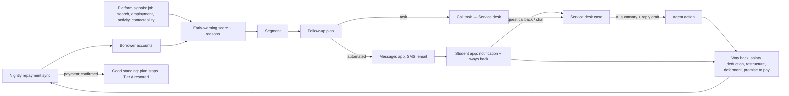

# Collections & Customer Service — Experience Flow (proposal for confirmation)

## Purpose and principles

Officers today can see programme totals (tier share, recoveries) and one record at a time, but they can't easily trace **who** has and hasn't been paying, spot who is **about to** fall behind, or follow up consistently. This module adds borrower-level tracking, explainable early-warning indicators, automated follow-up plans and an AI-assisted service desk. It slots into the existing agency workspace and student app.

**Principles** (the existing ones still hold):

- **Help first, collect second.** Every follow-up offers a way back (pay, salary deduction, restructure, deferment) before it asks for money.
- **The risk score prioritises people, it never punishes them.** A score never changes a tier, benefit or plan on its own. Tiers still come only from the repayment sync and the tier rules.
- **Students never see a risk score or a segment.** They only see helpful messages and ways back.
- **Repayment data stays in Collections.** It's never shown to employers or on job screens, and other agency roles still see a tier badge only.
- **Every AI output is explainable:** reasons, confidence and model version, like skill scores and evidence checks.
- **Every contact and action is logged** (who, when, channel, why). Contact caps and quiet hours are enforced.
- **Fictional data only** in the prototype. In production, the data comes from the nightly repayment sync.

## Roles

| Role | Collections access | New? |
| --- | --- | --- |
| Collection liaison | Everything in Collections. Owns follow-up plans, segments and early-warning settings; works High-risk borrowers | Existing role, expanded |
| Customer service agent | Service desk and borrower records for their cases: status, amount due, payments, timeline. No plan editing or tier rules | **New role** |
| Super admin | Everything, plus settings | Existing |
| Leadership viewer | Collections overview and reports (aggregates only, no individual borrowers) | Existing |
| Programme officer, AI governance lead, others | No change: tier badge only on the student record | Existing |

## Where it lives

The sidebar section **Repayment tiers** becomes **Collections**, visible to the collection liaison, customer service agent, super admin and leadership viewer (overview and reports only):

| Item | Who | Status |
| --- | --- | --- |
| Overview | Liaison, super admin, leadership | New |
| Borrowers (worklist) | Liaison, super admin; CS agent for their cases | New |
| Follow-up plans | Liaison, super admin | New |
| Service desk | CS agent, liaison, super admin | New |
| Tier rules · Sync monitor · Overrides · Distribution | Liaison, super admin | Existing, unchanged |

**Command centre** (agency Home) gains two queue cards that link here, on the same pattern as the existing queues: *Early-warning follow-ups* (owner: liaison) and *Service desk cases* (owner: CS agent).

## End-to-end flow

## Data

**From the repayment system (sync), per borrower:** status (grace, good standing, behind), days past due (DPD), amount due, next due date, last payment, payment method (manual, salary deduction), restructure or deferment status, grace end date.

**From the platform (signals, used only in Collections):**
- verified job applications this month vs the threshold;
- employment confirmed (placement verified);
- last active in the app;
- notification and message engagement;
- contactability (phone and email verified, bounced messages);
- an open way-back request;
- Talent Partner interest.

> **Consent:** using platform activity for repayment follow-up must be stated in the student consent text (PDPA). The consent version is shown on the borrower record.

**DPD buckets (configurable):** current · 1–30 · 31–60 · 61–90 · 90+.

## Early-warning indicator (simulated AI, deterministic)

Each borrower gets a **risk level: Low, Watch or High**. It comes with a 0–100 score, the **top 3 reasons** in plain language, a confidence and a model version (e.g. `earlywarn-0.3`).

| Signal (example weights) | Pushes risk |
| --- | --- |
| Grace ends in ≤ 30 days and no employment confirmed | Up |
| Job search below threshold for 2 months | Up |
| Missed or partial payment in the last 90 days | Up (strong) |
| No app activity in 60 days | Up |
| Unreachable (bounced SMS or email, no reply to 2 messages) | Up |
| Salary deduction active | Down (strong) |
| Employment confirmed | Down |
| Meets job-seeking threshold this month | Down |
| Open way-back request | Down |

- **Thresholds** (Watch ≥ 40, High ≥ 70) are settings.
- **Officers can mark a score "doesn't look right"** with a reason. That feeds the same quality review as skill scores (agreement rate).
- **Fairness:** risk level distribution by institution type and state, flagged when a group sits more than 15% above average (the same pattern as the existing Quality and fairness screen).

## Borrower segments (profiling)

Rules, not black boxes: each borrower falls into one segment, and each segment has a default follow-up plan.

| Segment | Rule (summary) | Default plan |
| --- | --- | --- |
| On track | Paying on schedule or salary deduction active | None (thank-you at milestones) |
| Grace · hired | In grace, employment confirmed | Set up repayment early (salary deduction offer) |
| Grace ending · searching | Grace ends ≤ 90 days, meets job-seeking threshold | Deferment information + job support |
| Grace ending · inactive | Grace ends ≤ 90 days, below threshold, low activity | Re-engage: job matches, learning, then repayment info |
| Employed · missed payment | Employment confirmed, DPD > 0 | Salary deduction offer → call task |
| Behind · searching | DPD > 0, at least half the job-seeking threshold | Restructure or deferment offer → call task |
| Behind · no recent activity | DPD > 0, below half the threshold | Reminder → call task |
| Unreachable | No successful contact in 60 days | Verify contact details → call task |
| Restructured · at risk | Restructured plan, payment late | Gentle reminder → call task |

## Screens

### 1. Collections overview (`/a/collections`)

- **Headline numbers with change:** paying on time %, borrowers by DPD bucket, Watch and High counts, recoveries this month, follow-ups due today, promise-to-pay kept rate.
- **One main chart:** the DPD bucket trend over 12 months.
- **Segment sizes,** each linking to the filtered worklist.
- **Today's work:** call tasks due, cases waiting, plans paused for review.

### 2. Borrowers worklist (`/a/collections/borrowers`)

*This is the "who has and hasn't paid" view.*

**Columns:**
- borrower (masked code, demo chip);
- institution, cohort;
- status, DPD, amount due;
- last payment, next due;
- segment;
- risk (level and top reason);
- job search (verified this month / threshold);
- last contact;
- current plan step;
- owner.

**Filters:** status, DPD bucket, risk, segment, state, institution, cohort, grace ends within N days, unreachable. Saved views: *High risk*, *Grace ends in 30 days*, *1–30 DPD*, *Promises due this week*.

**Search:** by borrower code. An IC search is allowed but logged with a reason, like an identity reveal.

**Bulk actions:**
- start or pause a plan;
- assign to an agent;
- export (logged).

### 3. Borrower record (`/a/collections/borrowers/:id`)

**Header:** masked identity (reveal with reason, logged), status, tier, DPD, amount due, owner.

**Panels:**
- **Payment history:** 12 months paid or missed, plus method.
- **Early warning:** level, score, top reasons, confidence, model version, and "Doesn't look right".
- **Platform signals:**
  - job search this month;
  - employment;
  - last active;
  - Talent Partner interest (a count only, never partner names).
- **Contact:**
  - preferred channel;
  - reachability;
  - consent version;
  - quiet hours;
  - contacts this week vs the cap.
- **Timeline:** payments, plan messages sent and opened, replies, calls with outcomes, service cases, overrides, notes.
- **Active plan:** each step shown as done, next or skipped, with its reason (e.g. "stopped: payment received").

**Actions:**
- Send message (template, BM/EN).
- Log call outcome (reached, no answer, wrong number, promise to pay with date).
- Offer a way back: salary deduction, restructure, deferment. This sends the offer to the student app.
- Start or pause a plan.
- Grant an override (existing flow).
- Open a service case.
- Add a note.

**Links:** to the Student record (programme view). The Student record shows "Open in Collections" only for permitted roles.

### 4. Follow-up plans (`/a/collections/plans`)

**List:** one plan per segment, with status (active or draft) and the borrowers in it this week.

**Plan editor:**
- **Trigger:** a segment, a risk level, or an event (grace ends in N days, payment missed, promise date passed).
- **Steps:** a day offset plus one of:
  - an automated message (app notification, SMS, email);
  - a call task for the service desk;
  - a wait.
- **Stop rules:** payment received, reply, way-back request, opt-out.
- **Message templates** in BM and EN, with tone guidance: ways back first, no threatening language. A preview shows how each message reads to the student.

**Guardrails (settings):**
- quiet hours (e.g. 9am–8pm);
- at most N contacts per borrower per week;
- allowed channels.

**Change flow:** same as tier rules. Draft → simulation ("312 borrowers would enter this week, ~1,040 messages") → second approver → active. Every send is logged.

### 5. Service desk (`/a/collections/service`)

**Case queue (with SLA chips):**
- callback requests and chats from the student app;
- call tasks from plans;
- payment questions and disputes;
- escalations.

**Case workspace:**
- **Left:** the conversation, or the call script with an outcome form.
- **Right:** a borrower context card (status, DPD, amount due, segment, risk reasons, last 3 timeline events).

**AI assist, all labelled and editable, never sent automatically:**
- a summary ("Graduated June 2025. Behind since August (1 missed, RM 180). Actively searching: 5 verified applications this month. Asked about lowering instalments.");
- a suggested next step;
- reply drafts in BM or EN, grounded in policy snippets (deferment, restructure, salary deduction rules).

**Resolution codes:** resolved, way back offered, promise to pay, escalated to liaison, wrong contact. The agent is accountable for what's sent.

### 6. Reports

**New report: Collections performance** (liaison, super admin, leadership):
- DPD roll rates;
- cure rate within 30 days of first contact;
- plan effectiveness (contacted → paid);
- promise-to-pay kept rate;
- early-warning precision (of borrowers flagged High, how many went on to miss a payment);
- service desk volume and handle time.

**Existing Repayment impact report:** unchanged.

## Student app integration (seamless, dignity first)

- **Messages:** plan messages arrive as normal notifications, plus SMS and email (simulated). Tone matches the Repayment page: benefits and ways back.
- **Repayment page:**
  - **Talk to us:** request a callback (pick a time) or send a message. This creates a service desk case. The open case shows its status ("We'll call you tomorrow, 10am–12pm").
  - **Offers from an officer:** salary deduction, restructure or deferment appear as cards with one-tap Accept or Ask a question.
  - **Promise to pay:** "I'll pay by [date]" confirms the date and pauses reminders until then.
- **Never on Home or job screens:** no risk scores, no segments, no amounts. Employers see nothing new.
- **Positive signals are visible to the student:** a verified job search and a confirmed job already show progress on Home and Repayment.

## Demo walkthrough (how it plays in the pitch)

1. **Collection liaison → Collections overview → High risk.** Kavitha is High (score 90). Top reasons: missed the August payment, 53 days past due, job search 2 of 4 for two months. Segment: *Behind · searching*.
2. **Open her record → Offer a way back → Restructure.** Her plan step is marked done.
3. **Switch to the student app (Kavitha).** A notification and an offer card are on Repayment. She taps **Talk to us → Request callback**.
4. **Customer service agent → Service desk.** Kavitha's callback case shows the AI summary and a reply draft in BM. The agent sends a reply from the AI draft and resolves the case as *Way back offered*.
5. **Kavitha accepts in the app → simulate sync.** She's back in good standing, her plan stops automatically, and recoveries tick up on the overview.
6. **Hafiz:** in grace and actively searching, so Watch → *Grace ending · searching* → deferment info message.
7. **Nurul:** Low risk, no plan. Shows that most students are never contacted.

## Settings (open decisions, as configurable placeholders)

- Early-warning thresholds (Watch, High) and which signals are switched on.
- DPD bucket boundaries.
- Contact cap per week, quiet hours, allowed channels.
- Whether customer service agents see amounts due (proposed: yes, for their cases).
- Whether plan messages need per-send approval or run automatically (proposed: automatic within approved plans).
- Two-person approval for new or changed plans (proposed: yes).
- Retention for call logs and messages.

## Governance and PDPA

- **Consent:** the consent text names repayment follow-up and platform-activity signals.
- **No automated adverse decisions:** scores only order the worklist and trigger supportive messages.
- **Explainability on every score:** reasons, confidence and model version.
- **Quality and fairness:** sampled reviews and fairness by group, the same as AI governance today.
- **Audit:** every message, call, reveal, export and plan change. Opt-out per channel is respected.
- **Collection conduct:** respectful language, contact caps and quiet hours enforced by the system.

## What changes in the current prototype

**New:**
- Collections section: 4 new screens and 1 new report.
- A new officer role, Customer service agent, with a fictional officer.
- 2 new queue cards on the Command centre.
- Student Repayment page: Talk to us, offer cards, promise to pay.
- Seeded fictional data: about 60 borrowers (the 3 demo students plus synthetic ones) with payment histories, signals and scores.
- Settings: an Early-warning & contact rules group.

**Extended:**
- `RepaymentGate` covers the CS agent role.
- Audit log record types: message, call, plan, case.
- DEMO_SCRIPT gets a new section.
- Smoke tests cover the walkthrough above.
- BM for all new strings.

**Unchanged:** tier rules, sync, overrides, job and employer screens, the hard constraints.
