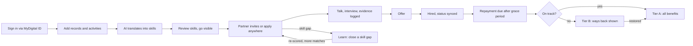

# Student Dashboard — Experience Flow

## Purpose and principles

The student dashboard is where a borrower turns campus records into a verified skill profile, gets found by Talent Partners, applies anywhere with proof, closes skill gaps, and sees how good repayment standing unlocks benefits.

**Who it serves:** final-year students and fresh graduates up to roughly 24 months after graduation, most still in their repayment grace period. Mobile first.

**Design principles**

- **Get found, and get credit for applying.** Talent Partners come to the student; for everything else, the platform helps students apply anywhere and proves they did.
- **Every score shows its evidence.** No skill level appears without the activities, documents and reasoning behind it.
- **One next action per screen.** Each screen answers "what should I do now?" with a single primary button.
- **Trusted sources only.** Partner roles come from vetted Talent Partners and open jobs from established portals, never from social media posts.
- **Repayment as reward, not punishment.** Standing is shown as benefits earned and how to earn them back, never as a debt warning on a job screen.
- **The student controls visibility.** Employers see an anonymised profile until the student accepts contact.
- **Bilingual.** Bahasa Melayu and English toggle on every screen.

## End-to-end journey

Two loops keep students moving: learning raises skill scores and unlocks more matches, and a student who falls behind on repayment sees clear ways back to Tier A.

## Onboarding: first run, screen by screen

About 8 minutes, ending with a live, AI-built skill profile the student has reviewed. Most data is pulled, not typed.

1. **Sign in.** MyDigital ID, or IC number plus PTPTN account number with OTP.
2. **Consent (PDPA).** Plain-language card: what data is pulled, who sees it, and that employers only see an anonymised profile. Single "I agree" button, link to full terms.
3. **Confirm what we found.** Auto-filled from the PTPTN loan record: institution, programme, graduation year, CGPA band. "Looks right" or edit.
4. **Add your academic record.** Upload transcript (PDF or photo) or pull from the university if connected. AI extracts courses, final-year project and grades.
5. **Tell us about campus life.** Guided cards, one activity at a time: club or society, role, duration, what you did, outcome, evidence (certificate, letter, photo).
   - Prompt examples under each field, e.g. "Organised a flood relief drive for 300 families."
   - Also accepts part-time work, internships, competitions and freelance work.
   - "Skip for now" allowed; the profile strength meter shows the cost.
6. **Job preferences.** Role interests (chips), preferred states, willingness to relocate, salary floor, earliest start date.
7. **AI translation in progress.** 10–20 second animated state: "Reading your transcript… Mapping 6 activities to skills…"
8. **Your skills revealed.** "We found 14 skills from 9 activities." Cards show skill, level and evidence count.
9. **Review and confirm.** For each skill: Keep, Edit level down, Hide, or "This isn't right". Students can add a missing skill, but it stays at Foundation until evidence is attached.
10. **Go visible.** Toggle: "Let Talent Partners find me." Default on, with a preview of exactly what employers see.
11. **Land on Home** with a 3-item setup checklist for anything skipped.

## Dashboard home

A single scrolling feed ordered by urgency: what needs a reply first, then progress, then growth. On desktop the feed sits in a main column with standing and skills in a right rail.

| Order | Module | What it shows | Primary action |
| --- | --- | --- | --- |
| 1 | Header | Greeting, profile strength %, BM/EN toggle, notifications bell | Open notifications |
| 2 | Your next step | Single most urgent action, e.g. "A Talent Partner wants to talk. Reply by Friday." or "1 application needs better evidence." | Context-specific (Reply, Re-upload, Pay) |
| 3 | Partner interest | This week: profile views and invitations from Talent Partners, change vs last week | View invitations |
| 4 | Partner roles | 3 premium role cards: role, partner, salary range, match %, "why you match" chips. Locked state below Tier A | Express interest |
| 5 | Job search this month | Applications logged, verified, under review; progress toward the active job-seeking threshold | Log an application |
| 6 | Open jobs for you | 3–5 roles from partner portals matched to top skills | Apply on portal |
| 7 | Skill snapshot | Top 5 skills with level and evidence count, plus one gap callout | Close this gap |
| 8 | Keep learning | Course in progress, or 1 recommended course tied to the gap | Continue |
| 9 | Repayment standing | Status badge, next payment or grace period end, benefits unlocked | View benefits |

**Home states**

- **New user, profile incomplete:** modules 3–5 replaced by the setup checklist and "Employers can't find you yet."
- **Profile live, no interest yet:** module 3 shows tips to raise visibility (add evidence, take a course).
- **Hired:** congratulations card, prompt to confirm employment, repayment setup. Job modules collapse.

## Skill profile and AI translation

Every skill is traceable to evidence, and the student can see exactly what employers see.

**How translation works (shown to the student as a simple explainer)**

1. **Extract.** AI reads transcripts, activity cards and evidence into structured facts: role, duration, scale, outcome.
2. **Map.** Each fact maps to a fixed skill taxonomy, so the same activity always yields the same skills.
3. **Score.** Level set by a visible rubric: duration, responsibility, scale, verified evidence.
4. **Explain.** Each skill gets a one-line plain-language rationale.

**Worked example**

Input: *Exco Logistik, Kelab Sukarelawan UKM, 2 years. Organised flood relief for 300 families, managed 25 volunteers. Certificate attached.*

| Skill | Level | Evidence | Why |
| --- | --- | --- | --- |
| Logistics coordination | Advanced | 2 items (activity, certificate) | Planned supply distribution for 300 families over 2 years |
| Team leadership | Working | 1 item | Led 25 volunteers in an exco role |
| Stakeholder communication | Working | 1 item | Coordinated with district office and donors |

**Skill card anatomy:** name, level (Foundation, Working, Advanced), evidence chips that open the source, confidence label, rationale line, actions: Edit level down, Hide, Add evidence, Dispute.

**Profile screen sections**

- AI-written summary line, editable.
- Skills grid grouped by category, sortable by level.
- Education and activities timeline, each item linked to the skills it produced.
- **"See as employer"** toggle: anonymised view with name, IC and photo hidden.
- **"Download my skill CV"**: exports the profile as PDF or shareable link for use on any portal.

**Rules:** students can lower a level but never raise it without new evidence. Adding evidence triggers a re-score, and the change is shown ("Team leadership: Working → Advanced").

## Opportunities: partner roles, open jobs and the job search log

PTPTN does not run a full job portal. Premium roles come from a small set of **Talent Partners** who commit jobs exclusively to PTPTN graduates; normal jobs live on existing portals; every application, wherever it happens, is logged as evidence. Three tabs: **Partner roles**, **Open jobs**, **My job search log**.

**Tab 1: Partner roles (premium, tier-gated)** — exist only inside this platform, so tier gating is meaningful.

1. Partners search anonymised profiles and send invitations, or post roles the AI matches to students.
2. Card shows: Talent Partner badge, role, salary range, location, "Why you match" with matched skills highlighted.
3. Student chooses: **Accept and share profile**, **Ask a question** (identity hidden), or **Decline** with reason chips that tune matching.
4. In-platform pipeline: Invited → Talking → Interview → Offer → Hired. Partners confirm hires directly; no evidence upload needed.
5. Below Tier A, partner roles show locked with "Unlock with good standing".

**Tab 2: Open jobs (normal, open to all)**

- Feed from partner job portals, only where PTPTN has a data agreement. No scraping.
- Each card links out to apply on the source portal; the click is recorded as a pending log entry.
- With no feed agreement, the tab becomes a curated portal list with search shortcuts by the student's top skills.
- Students can job hunt anywhere; any application counts once logged.

**Tab 3: My job search log**

1. **Log an application.** "I applied" → portal and role → evidence upload (confirmation email, screenshot, interview invite, offer letter).
2. **AI checks the evidence.** Reads the file, matches company and role, checks the date, flags reused or edited images.
3. **Status per entry:** Verified, Under review (sent to an officer), or Rejected with reason and re-upload.
4. **Update the outcome:** interview, offer, hired, closed.
5. **Monthly summary:** verified applications, interviews, and whether the active job-seeking threshold is met.

## Learn: closing skill gaps

Every course recommendation names the gap it closes and the roles it opens.

**Entry points:** gap callout on Home; "Close this gap" on a role card; a skill card; a decline reason naming a skill.

1. **Gap view.** Skill, current level, target level, "Unlocks 12 more matches".
2. **Course options.** 2–4 courses: provider, duration, cost (free, subsidised, paid), format, certificate type.
3. **Enrol.** One tap for hosted courses; external courses open the provider and are tracked by status.
4. **Learn.** Progress bar on Home and Learn; nudge after 5 days inactive.
5. **Complete.** Certificate auto-attached to the skill as evidence.
6. **Re-score.** "Advanced Excel: Foundation → Working. 9 new roles now match you."

**Sections:** In progress, Recommended for your gaps, Completed (with certificates), Browse all.

## Repayment standing and tier benefits

Shown only to the student, never to employers; framed as benefits earned plus a clear way back.

| Status | Who | Tier |
| --- | --- | --- |
| Grace period | Graduated, repayment not yet due | Tier A |
| Good standing | Paying on schedule, salary deduction, or keeping to a restructured plan | Tier A |
| Behind | Missed one or more scheduled payments | Tier B |

| Benefit | Tier A | Tier B |
| --- | --- | --- |
| Open jobs feed and job search log | Full | Full |
| Partner roles (premium, exclusive to PTPTN graduates) | Full access | Open decision: hidden, or visible after a 14-day early-access window |
| Courses | Full catalogue | Free courses plus first-module previews of premium courses |
| Profile boost in partner search | Yes | No |
| Career coaching session | 1 per quarter | No |

**Job search evidence counts too.** Meeting the monthly active job-seeking threshold can support a deferment or restructuring request, rewarding effort for students still looking.

**Repayment screen:** status badge with one-line meaning; next payment date and amount or grace period end; benefits list with ticks; last 6 payments; Pay now hands off to the official PTPTN payment channel.

**When a student falls behind**

1. Home card: "3 benefits are paused. Here's how to get them back."
2. Three ways back: pay the missed amount, set up salary deduction, or request a restructured plan.
3. Benefits restore when payment or plan approval is confirmed, with a celebration state.
4. No arrears figures on job screens. Locked partner cards show only a lock and "Unlock with good standing".

## Notifications and edge cases

| Event | Channel | Example message |
| --- | --- | --- |
| Partner invitation | Push, WhatsApp/SMS | "A Talent Partner wants to talk to you about a Logistics Executive role." |
| Invitation expiring | Push | "Your invitation from a Talent Partner expires in 2 days." |
| Interview scheduled | Push, email | "Interview confirmed: Thu 10am, video call." |
| New strong matches | Weekly digest | "5 new roles match 80%+ of your skills this week." |
| Skill re-scored | In-app | "Team leadership moved to Advanced." |
| Payment due | Push, 7 days before | "Your payment is due on the 15th. Stay in good standing." |
| Benefits paused or restored | Push | "Your benefits are back. Premium roles are unlocked." |
| Evidence checked | In-app, push if rejected | "Your application is verified." / "We couldn't read your screenshot. Please re-upload." |
| Job search threshold | Push, 7 days before month end | "2 more verified applications this month keep your job-seeking record active." |

**Edge cases**

- **No co-curricular record:** falls back to coursework, final-year project, part-time jobs, internships.
- **Still in final year:** profile can be built and previewed; visibility starts in the final semester.
- **Found a job elsewhere:** logged as Hired with an offer letter, verified like any evidence.
- **Disagrees with a skill:** dispute sends it to review; skill hidden from employers meanwhile.
- **Wants a break:** visibility off pauses discovery without deleting the profile.
- **Wants data deleted:** PDPA delete request from Settings.
- **Inactive 30 days:** one nudge with a concrete reason, then monthly digest only.

## Navigation

Bottom tab bar on mobile, left sidebar on desktop.

| Tab | Contains |
| --- | --- |
| Home | Next step, partner interest, roles, job search, snapshot |
| Profile | Skills, activities timeline, evidence, See as employer, skill CV export |
| Opportunities | Partner roles, Open jobs, My job search log |
| Learn | In progress, Recommended, Completed, Browse |
| Repayment | Standing, benefits, payments, ways back |

Settings (language, visibility, notifications, data and privacy) under the avatar.

## Open decisions (build with configurable placeholders)

- Partner roles for Tier B: hidden, or visible after a 14-day early-access window.
- Skill taxonomy source: own, or aligned to a national occupational skills standard.
- Does grace period count as Tier A from day one?
- University records: upload only, or direct integration.
- Does employment confirmation trigger repayment setup in PTPTN systems?
- Which portals for Open jobs feeds; link-out fallback.
- First 10–20 Talent Partners and their commitments.
- Monthly active job-seeking threshold and its link to deferment or restructuring.
